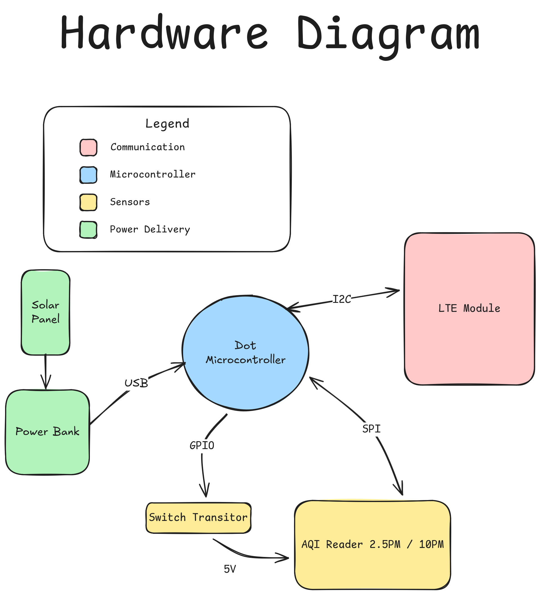
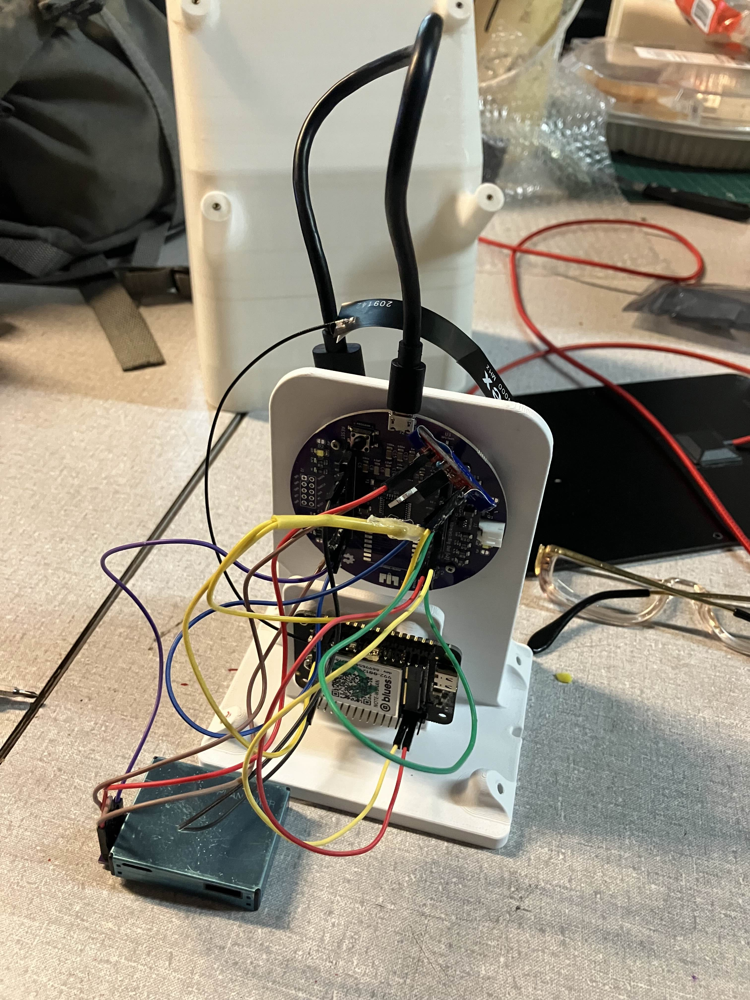

# Sudo Air: Air Quality Monitoring Network in the Bary Area

## [Air Quality Data Dashboard](https://unixjazz.crc.nd.edu/grafana/public-dashboards/1de305b9d07041d5874dd02ff67bad89)

# Description

## Background

One of the Sudo Room members, LF, conducted air quality research in Utqiaġvik, Alaska—the northernmost city in the state. During summers, dust from motorized vehicles and other factors create significant air quality challenges for residents. You can read more about that research here: [NNA Track 1: Understanding the Changing Natural-Built Landscape in an Arctic Community: An integrated sensor network in Utqiagvik, Alaska](https://www.nsf.gov/awardsearch/show-award/?AWD_ID=2022639&HistoricalAwards=false)

After the research project concluded, LF brought the equipment to Sudo Room and led a workshop during Radio Wednesdays. Members learned about the air quality nodes and reassembled them from scratch, then deployed them throughout the Bay Area.

These nodes have an extended operational lifespan since the Notecards and LTE modules consume minimal data. For more details, see the [Sudo Room Workshop Readme](https://gitlab.com/uva-arc/env-sense-workshop/-/blob/main/sensor-kits/bigdot-pm/workshop.md?ref_type=heads).

The workshop exemplified the intersection of engineering, environmental science, and citizen science.

> "WE WANT LAND, BREAD, HOUSING, EDUCATION, CLOTHING, JUSTICE, PEACE AND PEOPLE'S COMMUNITY CONTROL OF MODERN TECHNOLOGY." — The Black Panther Party

Technologies and Services used:

| Technology | Purpose |
|---|---|
| **MQTT** | Lightweight messaging protocol for real-time data transmission between air quality nodes and the processing infrastructure |
| **InfluxDB** | Time-series database for storing and querying air quality metrics (PM2.5, PM10, voltage, etc.) with high-performance data retention |
| **Notehub** | Cloud service that aggregates sensor data from distributed nodes and provides APIs for data access and management |
| **Docker** | Containerization platform for deploying consistent, scalable data processing services across environments |

# Deployment

For deployment instructions please see the [Deployment Instructions](docs/deployment.md)

# Hardware

[Firmware Repository](https://gitlab.com/uva-arc/env-sense-workshop/-/tree/main/sensor-kits/bigdot-pm?ref_type=heads)

{: style="max-width: 600px;" }

## Parts

- [1x Big Dot v2](https://github.com/unixjazz/bigdot)
- [1x Notecard v2.2 + Notecarrier X](https://blues.com/products/notecard/notecard-cell-wifi/)
- [1x Plantower PMS7003](https://aqicn.org/air/sensor/spec/pms7003-english-v2.5.pdf)
- 1x PMS-to-dupont adapter
- 1x MOSFET switch
- 1x Y cable
- 7x Female-Male DuPont cables
- 2x Female-Female DuPont cable

## Hardware Put Together without the Cover

# Data Infrastructure Architecture

The system architecture follows this data flow:

1. **Data Collection**: Air quality nodes send sensor data to Notehub over the LTE network
2. **Event Triggering**: Each data push triggers an event sent to a locally hosted MQTT broker
3. **Data Processing**: A Python script subscribes to the MQTT broker, parses the data, and pushes it to a local InfluxDB database
4. **Visualization**: InfluxDB serves as the data source for a Grafana dashboard hosted on a university server
5. **Exposure**: Cloudflare Tunnels expose both the local services and Grafana dashboard to external access

{: style="max-width: 600px;" }

## Environment Variables

This project requires a `.env` file in the root directory to store sensitive credentials and configuration. The following variables must be configured:

| Variable | Description | Sample Value |
|---|---|---|
| `MQTT_USERNAME` | Username for MQTT broker authentication | `air_quality_user` |
| `MQTT_PASSWORD` | Password for MQTT broker authentication | — |
| `MQTT_LOCAL_BROKER` | Hostname of the local MQTT broker | `localhost` |
| `MQTT_REMOTE_BROKER` | Hostname of the remote MQTT broker | `mqtt.example.com` |
| `MQTT_LOCAL_PORT` | Port for local MQTT connections | `1883` |
| `MQTT_REMOTE_PORT` | Port for remote MQTT connections | `8883` |
| `MQTT_PORT` | Default MQTT port | `1883` |
| `MQTT_WS_PORT` | WebSocket port for MQTT | `8080` |
| `CLOUDFLARE_TUNNEL_TOKEN` | Authentication token from Cloudflare Zero Trust Dashboard | — |
| `INFLUXDB_PORT` | Port for InfluxDB service | `8086` |
| `INFLUXDB_USERNAME` | Username for InfluxDB authentication | `influx_admin` |
| `INFLUXDB_PASSWORD` | Password for InfluxDB authentication | — |
| `INFLUXDB_ORG` | InfluxDB organization name | `sudo-air` |
| `INFLUXDB_BUCKET` | InfluxDB bucket for sensor data storage | `air_quality_metrics` |
| `INFLUXDB_TOKEN` | Authentication token for InfluxDB API access | — |

**⚠️ Security Note:** Never commit the `.env` file to version control. Add it to `.gitignore` to protect sensitive credentials.

# Air Quality Metrics information

Nodes collecting Air Quality Data. Has 2 units:

- 2.5 micron particles (PM2.5) are extremely fine airborne pollutants, smaller than a human hair, that pose significant health risks because they can deeply penetrate lungs and enter the bloodstream, causing respiratory issues, heart problems, and other serious conditions, originating from sources like vehicle exhaust, factories, and wood burning, and are often monitored for air quality alerts.

- 10 micron (µm) particles, known as PM10, are a significant air pollutant: coarse dust, pollen, and mold that are inhalable (under 10 µm) but typically get trapped in the nose/throat, causing irritation, though larger ones (2.5-10 µm) can enter the lungs, affecting those with heart/lung conditions; they're a mix from industry, vehicles, dust, etc., and while less harmful than smaller PM2.5, they still pose health risks, with good masks helping filter them.

Also has data:
- location (closest cell tower)
- voltage (battery life?)
- capture time

all of the nodes publish their data here
- https://notehub.io/project/app:b524d40a-52fc-4acd-a198-571298759ff3/devices

to see my specific node data go to events and filter

# Information on AQI levels
https://atmotube.com/blog/particulate-matter-pm-levels-and-aqi
